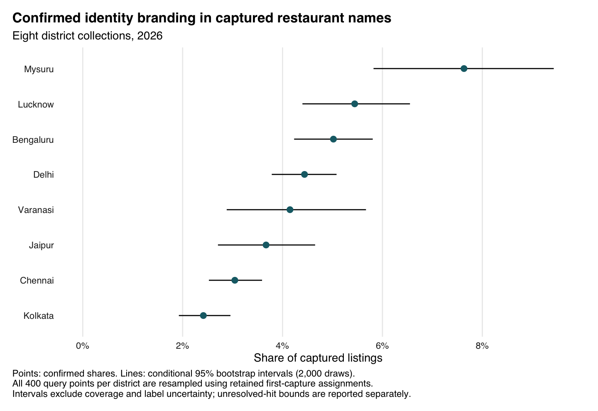
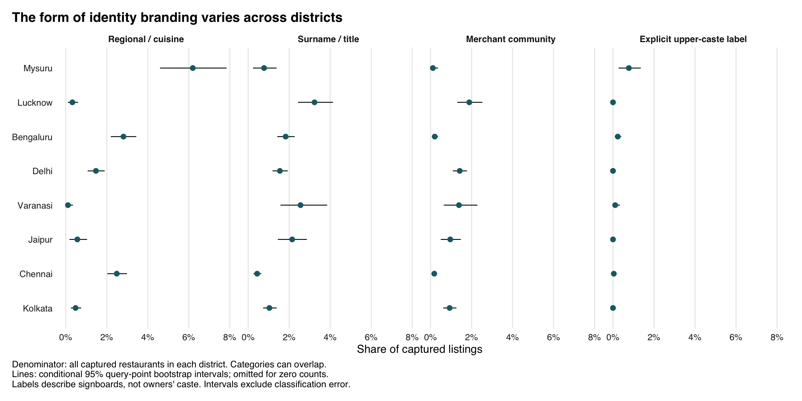

# Caste and community in Indian restaurant names

How often do restaurants put caste or community identity in their names?
We study 21,719 restaurant listings captured around randomly selected
street segments in eight Indian districts, three earlier city grid
collections, and digitized trade directories from 1918–1928. The outcome
is branding on a signboard, not an inference about an owner’s caste or
the clientele.

Confirmed identity branding ranges from 2.4% to 7.6% of captured
listings across the sampled districts. Explicit upper-caste labels occur
in at most 0.8% of captured names. The southern collections feature
regional cuisine; surnames and merchant communities account for more of
the northern pattern. These are descriptive comparisons of platform
listings, not population estimates for every restaurant in a district.

## Results

| District | n | Any, % \[interval\] | Regional / cuisine, % | Surname / title, % | Merchant, % | Upper-caste, % | Unresolved |
|:---|---:|---:|---:|---:|---:|---:|---:|
| Mysuru | 904 | 7.6 \[5.8, 9.4\] | 6.2 | 0.8 | 0.1 | 0.77 | 0 |
| Lucknow | 1855 | 5.4 \[4.4, 6.6\] | 0.3 | 3.2 | 1.9 | 0.00 | 0 |
| Bengaluru | 3447 | 5.0 \[4.2, 5.8\] | 2.8 | 1.8 | 0.2 | 0.23 | 0 |
| Delhi | 4009 | 4.4 \[3.8, 5.1\] | 1.5 | 1.5 | 1.4 | 0.00 | 0 |
| Varanasi | 940 | 4.1 \[2.9, 5.7\] | 0.1 | 2.6 | 1.4 | 0.11 | 0 |
| Jaipur | 1771 | 3.7 \[2.7, 4.7\] | 0.6 | 2.1 | 1.0 | 0.00 | 0 |
| Chennai | 5025 | 3.0 \[2.5, 3.6\] | 2.5 | 0.4 | 0.2 | 0.04 | 1 |
| Kolkata | 3768 | 2.4 \[1.9, 3.0\] | 0.5 | 1.0 | 0.9 | 0.00 | 0 |

The intervals are conditional 95% percentile bootstrap intervals over
query points, using the collector’s retained first-capture assignments.
They do not account for platform coverage, query caps, overlapping
catchments, or classification error. Unresolved matches contribute to
the denominator but not the confirmed numerator; the data tables also
report an upper bound that counts all unresolved matches. These bounds
address unresolved dictionary hits, not names missed by the dictionary.





The historical data are a different analytic universe. Among the 18
Indian-run eating houses listed for Madras in 1925, 15 carry a coded
identity or purity marker (83.3%), while 0 carry an explicit caste
marker. The broader historical measure includes Hindu, Military,
Vilas/Bhavan, communal, and regional labels. Differences in source
coverage and coding prevent interpreting this comparison as an estimated
tenfold historical decline in the same outcome.

The surname supplement screens for names with high combined SC/ST shares
in the companion SECC lookup. Its output is a **candidate list requiring
contextual review**, not a count of SC/ST owners. The earlier README
described hand-reviewed findings but the repository does not contain a
separate reproducible adjudication table for those surname candidates;
the new report does not repeat those findings as verified estimates.

## Design and measurement

The sampled collections use 400 OSM street segments per district,
sampled with seed 42 within GADM boundaries. Each midpoint was queried
in English through Places Nearby Search (New), with a 300 m radius,
distance ranking, and a 20-result cap. The collector records each place
once, under the first query that returned it. A query point with no
retained first capture is not necessarily a query with no restaurant
results.

The 2025 grids combine Google Places and OSM listings in Bengaluru,
Chennai, and Mysuru. Cross-source linkage requires token Jaccard
similarity of at least 0.5 and coordinates within 200 m, with one-to-one
greedy matching. Nearby chain branches can still be mismatched.
Chennai’s earlier collection used Kannada rather than Tamil and stopped
at a 200-cell cap. Grid shares are descriptive; the R report does not
attach binomial sampling intervals to these nonprobability collections.

The dictionary uses exact boundaries and curated variants. R normalizes
Unicode with stringi/ICU and transliterates to Latin. All collections
now use the same v3 dictionary. An archived mapping preserves the old
normalization keys for joining saved verdicts and exclusions.
Transliteration changes and new dictionary matches are exported for
review.

The saved local-model verdicts can veto regional terms used as
incidental address text. Non-regional terms retain the dictionary
classification when a verdict exists, subject to the documented
exclusion list: the original model sometimes rejected real surnames on
factual grounds. Neither this rule nor deterministic model settings
establish ground truth. The build reports 20 unresolved restaurant–label
pairs across all collections; it does not rerun Ollama automatically.

Inverse local street density is retained as a sensitivity analysis, not
called an inclusion-probability weight. Restaurant capture also depends
on query caps, catchment overlap, platform inclusion, and the order of
first capture. The audit reports all query points, capped shares, label
uncertainty, and comparisons with the archived estimates in [Methods and
audit](docs/methods.md).

## Reproduce

R owns analysis and reporting; Python owns collection and model
adjudication. Use R with the packages in `renv.lock`, Python 3.12 or
later, uv, and Pandoc. The SC/ST surname supplement also requires the
companion Parquet lookup.

``` bash
make sync
make check
```

`make check` runs both languages’ linting and tests, rebuilds analysis
and figures, and regenerates this README and the methods report. The
analysis uses local files and makes no service calls. Set
`SURNAME_LOOKUP` if the companion input is not at the default path:

``` bash
SURNAME_LOOKUP=/path/to/per_name_secc_weighted.parquet make check
```

Individual targets are `make analysis`, `make figures`, `make report`,
`make lint`, `make test`, and `make format`. `make ci-docker` runs the
Python checks in the standard Python image. Run commands from the
repository root. Edit `README.Rmd`, not the generated `README.md`.

Optional collection and adjudication remain explicit commands:

``` bash
uv run python scripts/sample_frame.py --city Chennai --n 400 --seed 42 --radius-m 300
uv run python scripts/collect_restaurants.py --use-google-places --api new \
  --location maa2 Chennai 13.0827 80.2707 15 --languages en \
  --places-radius-m 300 --points-csv data/sampling/chennai_segments_n400_seed42.csv \
  --basepath /path/to/new_collection
Rscript scripts/match_collection.R /path/to/new_collection_maa2_raw_collection.jsonl \
  /path/to/new_analysis
uv run python scripts/adjudicate_matches.py --basepath /path/to/new_analysis \
  --out /path/to/new_adjudication.jsonl
uv run python scripts/historical_directories.py --download
```

Places collection needs `GOOGLE_API_KEY`; adjudication needs a local
Ollama server with `qwen3:8b`. These commands are not prerequisites for
reproducing the frozen analysis and should use fresh destinations. Model
verdicts are checkpointed and missing answers are retried on a later
invocation.

## Files

| Path | Purpose |
|----|----|
| `R/` | Matching, linkage, estimation, supplementary analysis, and figure functions |
| `scripts/99_run_all.R` | Offline analysis, figures, and reporting |
| `scripts/*.py` | Collection, frame preparation, reconstruction, and adjudication |
| `data/reference/` | Dictionary, archived normalization keys, screening sample, and provenance |
| `data/` | Frozen collections, labels, exclusions, original outputs, and historical coding |
| `out/tab/` | Estimates, sensitivities, audit comparisons, review queues, input checksums |
| `out/fig/` | PNG and PDF exhibits |
| `out/matches/` | Regenerated JSONL input for optional Python adjudication |
| `tests/` | R analytical tests and Python collection/adjudication tests |

Original files under `data/` remain unchanged. Current outputs live
under `out/`. The dictionary and frozen screening sample are research
inputs; changing them is an analytical revision. See
`data/reference/README.md` for their extraction provenance.

## References

Conlon, Frank F. 1995. “Dining Out in Bombay.” In *Consuming Modernity:
Public Culture in a South Asian World*, ed. Carol A. Breckenridge,
90–127. Minneapolis: University of Minnesota Press.

Marriott, McKim. 1968. “Caste Ranking and Food Transactions: A Matrix
Analysis.” In *Structure and Change in Indian Society*, eds. Milton
Singer and Bernard S. Cohn, 133–171. Chicago: Aldine.
